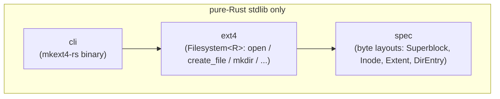
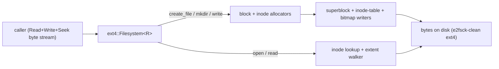
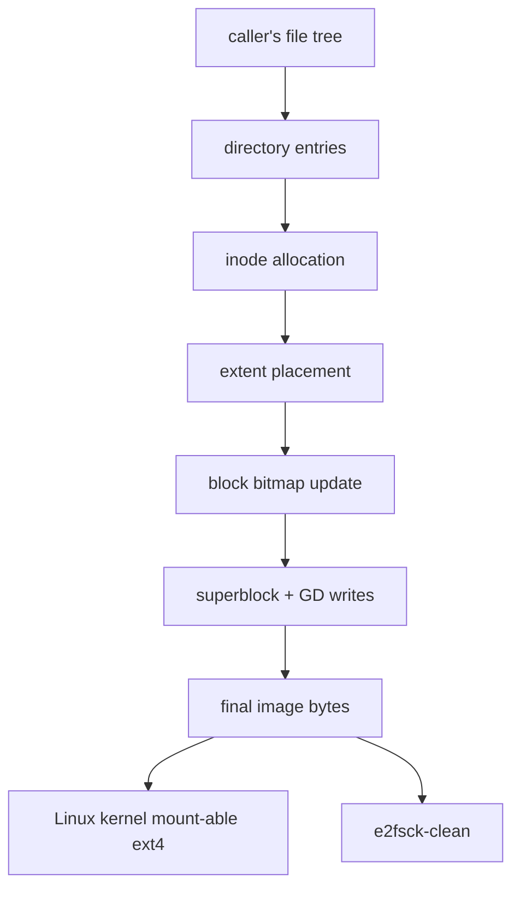
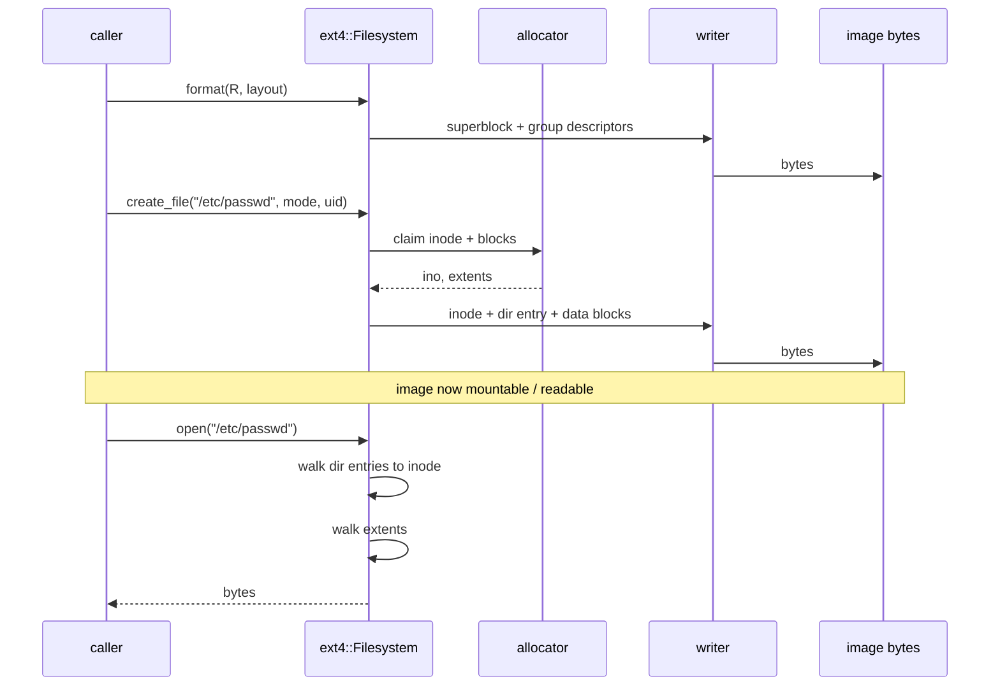

# Architecture

**Audience**: Architects, contributors

> **TLDR**: Three-crate pipeline — spec (byte layouts, no IO) → ext4 (`Filesystem<R>`, format/read/write API) → cli (`mkext4-rs` binary) — with a contiguous-block allocator and symmetric encode/decode for byte-stable, reproducible output.

## Diagrams

Four diagrams covering inclusion (which crates depend on which), block (runtime layout of a typical write/read), data flow (file tree → image bytes), and sequence (the build then read calls). The ASCII pipeline below is the same picture in a different style.

### Inclusion: workspace dep graph



### Block: runtime layout



### Data flow: file tree → image bytes



### Sequence: build then read



## Pipeline (ASCII)

```
                       ┌──────────────────┐
                       │  Read+Write+Seek │
                       │  byte stream     │
                       │  (File, Cursor,  │
                       │   anything)      │
                       └────────┬─────────┘
                                │
                                ▼
                       ┌──────────────────┐
                       │  ext4 crate      │
                       │  Filesystem<R>   │
                       │  open / read /   │
                       │  create_file /   │
                       │  mkdir / unlink  │
                       │  rmdir / symlink │
                       │  truncate /      │
                       │  rename / chmod  │
                       │  / chown / utime │
                       └────────┬─────────┘
                                │ struct decode + encode
                                ▼
                       ┌──────────────────┐
                       │  spec crate      │
                       │  Superblock      │
                       │  GroupDescriptor │
                       │  Inode           │
                       │  Extent / Tree   │
                       │  DirEntry        │
                       │  bitmap helpers  │
                       └────────┬─────────┘
                                │ pure byte layouts, no IO
                                ▼
                       ┌──────────────────┐
                       │  bytes on disk   │
                       │  (e2fsck-clean,  │
                       │   kernel-mount-  │
                       │   able ext4)     │
                       └──────────────────┘

                                ╲
                                 ╲   consumers reach the same
                                  ╲  pipeline via the binary:
                                   ╲
                                    ▼
                       ┌──────────────────┐
                       │  cli crate       │
                       │  mkext4-rs       │
                       │  format /        │
                       │  inspect / touch │
                       │  / cat / chmod / │
                       │  chown / utime / │
                       │  build-from-tree │
                       └──────────────────┘
```

## Three crates

| Crate                | Role                                                                              |
|----------------------|-----------------------------------------------------------------------------------|
| `swe_justext4_spec`  | On-disk format types — pure structs, decode + encode, no IO. The single source of truth for byte layouts. |
| `swe_justext4_ext4`  | `Filesystem<R: Read + Seek>` (write methods bound by `where R: Write`). Owns IO + arithmetic; layers on top of spec. |
| `swe_justext4_cli`   | `mkext4-rs` operator binary + library half. Subcommands wrap the lib API.        |

The crates form a strict dependency line: `cli` → `ext4` → `spec`. The
`spec` crate has no dependencies on the rest of the workspace and could
be lifted into a standalone crate without code change.

## Read path

```
File / Cursor
    │
    ▼  open() seeks to offset 1024
read superblock bytes ──────► Superblock::decode ──► validates magic, block size, layout
    │
    ▼  GDT block = first_data_block + 1
read GDT bytes      ──────► GroupDescriptor::decode (× group_count)
    │
    ▼  inode table = gdt[group].inode_table
read inode bytes    ──────► Inode::decode → InodeFileType, links, size, i_block[60]
    │
    ▼  if uses_extents()
decode_extent_node(i_block) ──► ExtentNode::Leaf | Internal
    │                                         │
    ▼  Leaf                                   ▼  Internal
find extent covering logical block       seek to leaf_block, recurse
    │
    ▼  resolve_logical_block returns Some(physical) | None (sparse / uninit)
    │
    ▼  read_file: per logical block, seek + read; zero-fill on None; truncate to inode.size
returned bytes
```

For directories the same chain applies, with `decode_dir_block` walking
the returned bytes; `lookup` and `open_path` chain `read_file` +
`decode_dir_block` recursively.

## Write path

```
caller (bytes, path, ...)
    │
    ▼  e.g. create_file(path, data)
split_path(path) → (parent_path, filename)
open_path(parent_path) → parent_inode_num
read_inode(parent_inode_num) → parent_inode
lookup(parent_inode, filename)
    │
    ├── Ok(_)        → AlreadyExists
    └── NotFound     → continue
                     │
                     ▼
allocate_inode    ── from group 0's inode bitmap (find_first_zero), set bit
allocate_blocks   ── from group 0's block bitmap (find_first_zero_run), set bits
build Inode       ── mode, size, links_count, extents flag, i_block = extent header + leaf
write_inode       ── seek to inode-table slot + write
write data blocks ── seek to physical block * block_size + write
add_dir_entry     ── parent's first data block: shrink last entry's rec_len, place new entry
flush_metadata    ── re-encode + write superblock + GDT (in-memory deltas: free counts)
```

`mkdir`, `symlink`, `unlink`, `rmdir`, `truncate`, `rename`, and the
metadata ops follow the same allocator + dir-entry shape, with op-
specific details:

- **`mkdir`** allocates one data block for the dir contents (`.` + `..`),
  bumps parent's `links_count`, bumps GDT `used_dirs_count`.
- **`unlink` / `rmdir`** mirror in reverse: free blocks, free inode,
  remove dir entry (merge with predecessor or tombstone), stamp inode
  as deleted (`links_count = 0`, `dtime` set).
- **`truncate` shrink** walks the leaf extent, frees trailing blocks past
  the new size; **grow** is supported only within the existing extent's
  block-aligned range (no allocation).
- **`rename`** captures the source's file_type + inode num, adds the new
  entry, removes the old. Cross-dir directory moves update the moved
  dir's `..` entry and transfer 1 link from the old parent to the new.
- **`symlink`** stores the target inline in `i_block` (fast symlink only,
  ≤ 60 bytes); `flags` is intentionally 0 (no `INODE_FLAG_EXTENTS`).
- **`chmod` / `chown` / `utime`** all DRY through a private
  `with_inode_mut` helper that bumps `ctime` to a pinned constant.

## Key design decisions

### Pure Rust, no FFI, no shell-out

The whole point. Reading + writing happens through structs and byte
manipulation, not through `mkfs.ext4` or `mount`. The output is real
ext4 — verified by both `e2fsck -nf` and `mount -o loop` through
the kernel.

### Encode + decode symmetric in spec

Every type with a `decode(buf, ...)` has a matching `encode_into(buf, ...)`.
Round-trip tests in spec assert `decode → encode → decode` preserves
every field. The encoders are what `mkfs::format` and the write API
rely on; without them, we'd be poking bytes at hard-coded offsets in
two places (the test helpers + the formatter), guaranteed to drift.

### Byte-stable output

`mkfs::format` uses pinned constants for timestamps, UUID, and the
directory hash seed. The same `Config` produces byte-identical output
across runs — pinned by an always-on test in
`ext4/tests/reproducibility.rs`.

This matters for any consumer that wants to verify "did anything in
the input change?" by comparing image digests across builds — the
same guarantee any SLSA-attested artifact pipeline requires.

### Single-group v0

The kernel's `blocks_per_group = block_size * 8` rule (one group's worth
of blocks fits in a single bitmap block) caps a single-group image at
~128 MiB at 4 KiB blocks. v0 stops there. Multi-group is tracked as
[issue #4](https://github.com/sweengineeringlabs/justext4/issues/4).

The allocator (`allocate_inode` / `allocate_blocks_contiguous`) operates
strictly on group 0. Lifting this means: walk groups looking for free
space, update GDT entries per group, write group-N's bitmap blocks,
accept fragmentation since "contiguous run within one group" is no
longer a meaningful constraint at scale.

### Contiguous-only allocation

`allocate_blocks_contiguous` requires N free contiguous blocks in the
bitmap. After enough `create_file` + `unlink` churn, an image will
fragment and large allocations will fail. Tracked as
[issue #5](https://github.com/sweengineeringlabs/justext4/issues/5).

### Why not depend on `bytemuck` / `zerocopy`

Tempting for any byte-layout crate. We don't:

- Defends the "pure Rust, no proc-macros, MSRV stable for years" promise
- The on-disk format is small and stable; hand-rolled encode/decode is
  ~1500 LOC across all spec types
- Fuzz coverage (issue-tracked targets in `fuzz/`) gives us confidence
  in the manual paths

### `Filesystem<R>` is the only handle, IO bound at method site

The struct is `<R>` (no IO bound on the struct itself). Read-only
methods are `where R: Read + Seek`. Write methods add `where R: Write`.
This lets a consumer hold a `Filesystem<File>` and call any method;
a consumer holding `Filesystem<&[u8]>` (read-only mmap) only sees the
read methods.

## Known consumers

- [`vmisolate`](https://github.com/sweengineeringlabs/vmisolate) —
  first consumer. `scripts/build-rootfs-justext4.sh` wraps `mkext4-rs
  build-from-tree` to produce kernel-mountable rootfs images without
  WSL, replacing the `mkfs.ext4 + mount + cp -a + umount` shell-out
  on the scratch-base path.
